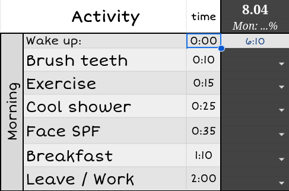
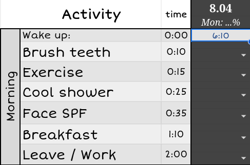
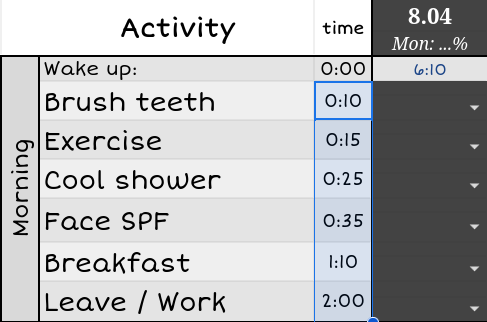
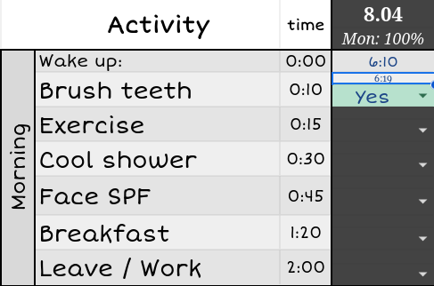
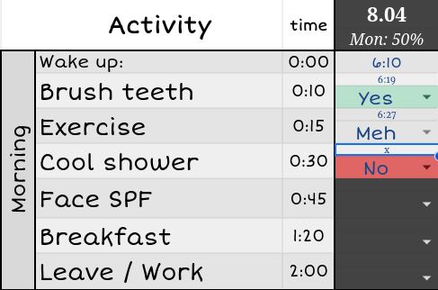
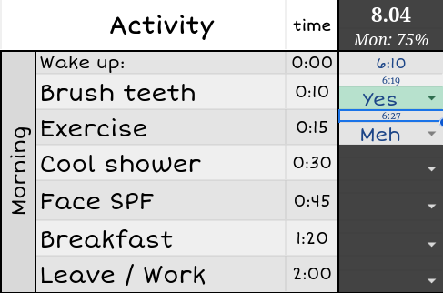
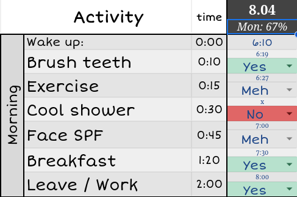

# Routine Tracker
Track the daily progress of your routine goals with an automatized spreadsheet, and never be late for work again!

| Cell | Functionality |
|-------|------|
|  | Baseline time: preferably 0:00 but it can also be a specific hour. |
|  | The time at which you're planning to wake up on that day. |
|  | How much timm does each activity have to take at most. |
|  | The time at which you've completed it: if you managed  within the limit, the below cell becomes "Yes". |
|  | If you've completed the activity but didn't manage  to do it on time, the below cell becomes "Meh". |
|  | If you're not doing it at all: once "x" is put,  the below cell becomes "No". |
|  | You can see the percentage of your activities' completion (where each "Yes" counts as 1 and each "Meh" counts as ½). |
